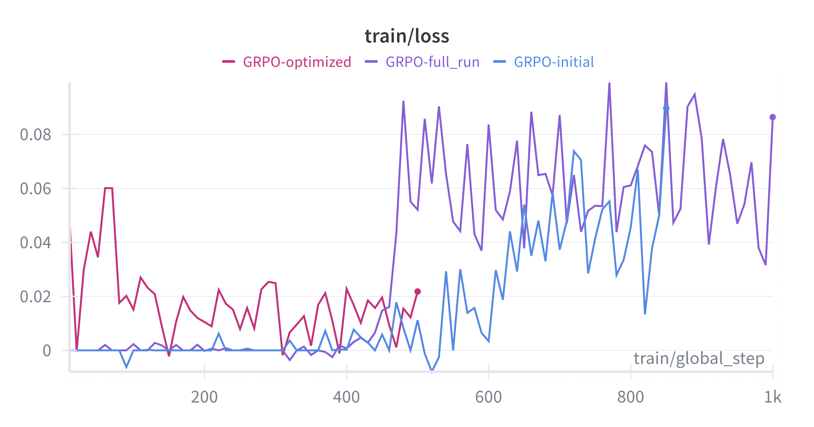
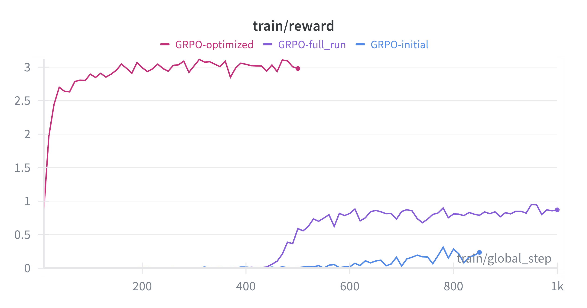
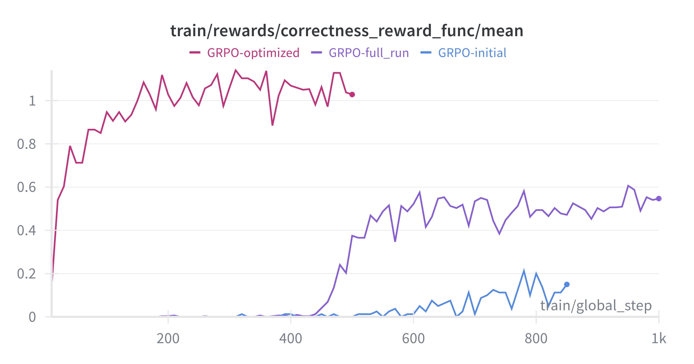
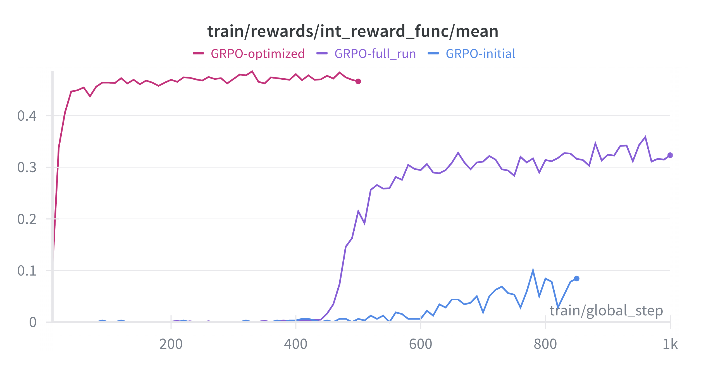
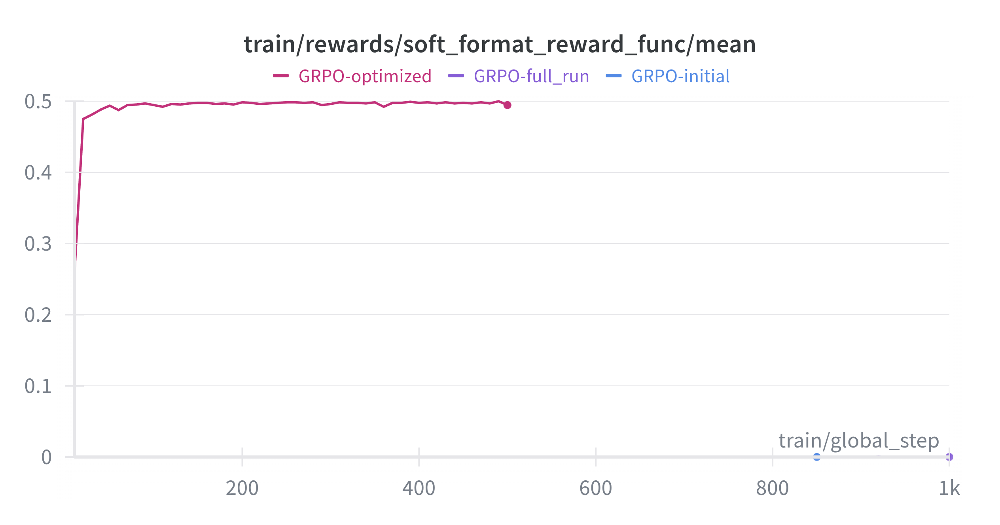
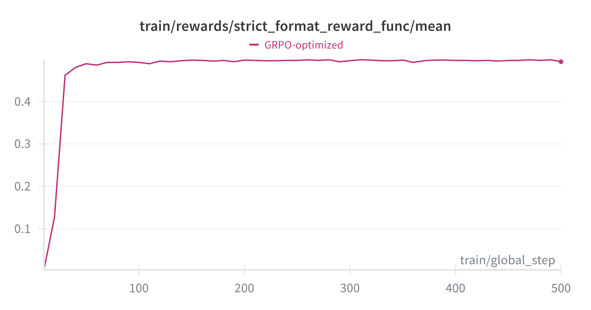
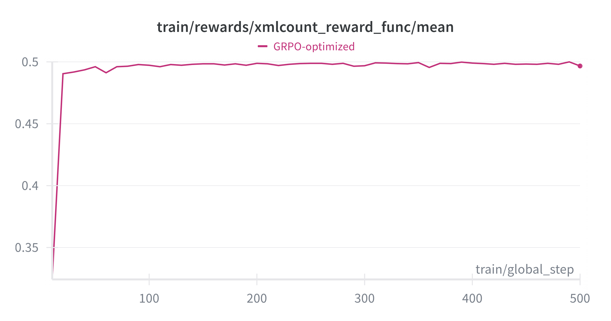

# GRPO Reimplementation: Qwen2.5-0.5B-Instruct

This repository contains a reimplementation of **Group Relative Policy Optimization (GRPO)** from the [DeepSeek-R1 paper](https://arxiv.org/abs/2501.12948). The GRPO algorithm fine-tunes language models to improve reasoning capabilities by incorporating intermediate and format-based reward functions.

We used **Qwen2.5-0.5B-Instruct** as our base model.

The final trained model is available on Hugging Face: [Qwen-0.5B-Instruct-GSM8K-GRPO](https://huggingface.co/Hpremier/Qwen-0.5B-Instruct-gsm8k-GRPO).

---

## Features

- GRPO fine-tuning for improved reasoning quality.
- Multiple reward functions: correctness, integer validation, soft format, strict format, XML tag count.
- Sample evaluation on the GSM8K benchmark.
- Demonstrates improvements in accuracy and reasoning structure.

---

## Installation

We recommend using Python 3.10+ and a CUDA-enabled GPU for training and evaluation.  

Install required packages:

```bash
pip install torch transformers trl datasets accelerate tqdm regex
```

# Sample Prompt/Response

## Prompt:
```text
In a dance class of 20 students, 20% enrolled in contemporary dance, 25% of the remaining enrolled in jazz dance, and the rest enrolled in hip-hop dance. What percentage of the entire students enrolled in hip-hop dance?
```
## Base Model Output (Qwen2.5-0.5B-Instruct):
```text
In a dance class of 20 students, 20% enrolled in contemporary dance, 25% of the remaining enrolled in jazz dance, and the rest enrolled in hip-hop dance. What percentage of the entire students enrolled in hip-hop dance?
assistant
Let's break down the problem step by step:

1. **Total Students**: There are 20 students in total.

2. **Contemporary Dance Enrolled**:
   - 20% of 20 students enroll in contemporary dance.
   - Calculation: \( 0.20 \times 20 = 4 \) students.

3. **Remaining Students After Contemporary Dance**:
   - Subtract the 4 students who enrolled in contemporary dance from the total number of students to find out how many remain.
   - Calculation: \( 20 - 4 = 16 \) students.

4. **Jazz Dance Enrolled**:
   - 25% of the remaining 16 students enroll in jazz dance.
   - Calculation: \( 0.25 \times 16 = 4 \) students.

5. **Hip-Hop Dance Enrolled**:
   - The rest of the students (those not enrolled in jazz dance) will be enrolled in hip-hop dance.
   - Since there are 16 students in total after accounting for those enrolled in jazz dance, subtract this from the remaining students to find out how many are left for hip-hop dance.
   - Calculation: \( 16 - 4 = 12 \) students.

6. **Percentage of Hip-Hop Dance**:
   - To find the percentage of students enrolled in hip-hop dance, divide the number of students enrolled
```

## GRPO Trained Output:
```text
<reasoning>
There are 20 students in total.
20% of the students enrolled in contemporary dance, so 20/100 * 20 = 4 students enrolled in contemporary dance.
The remaining number of students is 20 - 4 = 16 students.
25% of these remaining students enrolled in jazz dance, so 25/100 * 16 = 4 students enrolled in jazz dance.
The number of students remaining after jazz dance enrollment is 16 - 4 = 12 students.
Therefore, the percentage of the entire students enrolled in hip-hop dance is 12/20 * 100 = 60%
</reasoning>
<answer>
60
</answer>
```
## Training Results

### Loss and Reward Curves

<p float="left">
  
  
</p>

### Reward Component Contributions

<p float="left">
  
  
</p>

<p float="left">
  
  
</p>

<p float="left">
  
</p>
